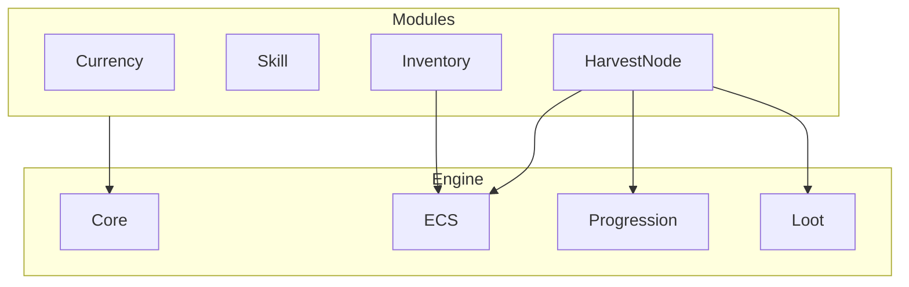

# Modules
Modules in IdelPog are plugin logic providers for the engine. Modules can do anything from handling simple `Currency`, 
to handling an `Inventory` system with built-in Crafting. The scope of each individual module is defined by the module itself.

Modules should never depend on another module. Modules should only depend on `Core` and other helper projects like `ECS`. 

---

Everything in `Modules` is implied to depend on `Core`.

- All Modules depend on `Core`.
- Some modules may depend on `ECS`, `Progression`, or `Loot`.
- Modules must never depend on other Modules.

---

## Index

| Module                                 | Description                                              |
|----------------------------------------|----------------------------------------------------------|
| [Currency](./Currency/README.md)       | Handles player `Currency` and mutation commands.         |
| [Skill](./Skill/README.md)             | Handles `Skill` and their `Levelable` based progression. |
| [Inventory](./Inventory/README.md)     | Handles all player `Item`s and actions related to them.  |
| [HarvestNode](./HarvestNode/README.md) | Handles nodes that the player can harvest for `Item`s.   |
